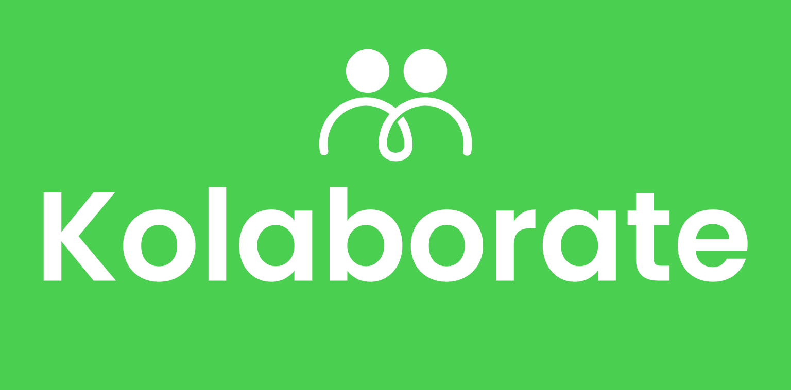

<p align="center">
  
</p>

Below is an updated version of your README with enhanced clarity, detail, and a more lively tone. I've also added sections to emphasize the ongoing nature of the hackathon, the shared resources, and clear instructions for newcomers to GitHub.

# Kolaborate Hackathon Repository 🚀

Welcome to the **Kolaborate Hackathon** – the vibrant, ever-evolving coding arena where creativity meets innovation! This repository is your gateway to a continuous, weekly hackathon designed to showcase and celebrate the technical prowess of developers across Uganda. Whether you're a seasoned coder or new to GitHub, we're here to guide you every step of the way.

## What Is the Kolaborate Hackathon?

The Kolaborate Hackathon is not a one-time event—it's an ongoing journey. Each week, we release new challenges that invite you to build innovative solutions to real-world problems. Our mission is to highlight the incredible diversity of code and design solutions that developers can bring to life. Every submission is more than just code; it's a statement of creativity, technical skill, and the spirit of collaboration.

**Key Points:**
- **Continuous & Weekly Challenges:** Enjoy a dynamic experience where new challenges are introduced weekly and the hackathon goes on indefinitely.
- **Showcase Your Skills:** Demonstrate your ability to deploy, host, and maintain your projects, and let the world critique and celebrate your work.
- **Community & Learning:** Gain access to a treasure trove of resources, including curated learning materials, GitHub repositories, and custom starter kits—all designed to help you succeed.

## Repository Structure

We've organized the repository to keep everything neat and accessible:

.
├── submissions/                    # All hackathon submissions by challenge
│   ├── content-calendar/          # Content Calendar Challenge
│   ├── customer-support/          # Customer Support Challenge
│   └── project-management/        # Project Management Challenge
├── winners/                       # Showcase of winning projects
│   └── challenge-name/            # Winners categorized by challenge
└── resources/                     # Shared resources, guides, and learning materials

- **Submissions:** Place your project submissions under the relevant challenge folder.
- **Winners:** Check out the winning projects to see what excellence looks like.
- **Resources:** Find useful links, guides, custom starter kits, and more to help you deploy and host your projects.

## Available Challenges

Each challenge is crafted to push your creativity and technical skills. Here's a snapshot of our current challenges:

1. **Content Calendar Challenge**
   - **Objective:** Build an innovative content planning and scheduling solution.
   - **Focus:** Enhance user experience and foster team collaboration.
   - **Features:** Incorporate modern content management capabilities.

2. **Customer Support Challenge**
   - **Objective:** Create a comprehensive customer support platform.
   - **Focus:** Leverage automation to enhance support operations.
   - **Features:** Improve overall customer service through efficient design.

3. **Project Management Challenge**
   - **Objective:** Develop an effective project and task management system.
   - **Focus:** Promote team collaboration and transparency.
   - **Features:** Integrate cutting-edge project tracking functionalities.

*Note: New challenges may be added as the hackathon continues, so keep an eye on our announcements!*

## Submission Guidelines

For first-timers, here's a detailed, step-by-step guide to submitting your project:

1. **Fork or Clone:** Start by forking or cloning this repository to your local machine.
2. **Create a New Branch:** Branch off from `main` using the format:  
   `submission/your-name-challenge-name`
3. **Organize Your Work:**
   - Navigate to the appropriate challenge folder under `submissions/`.
   - Create your project folder using the format:  
     `team-name-project-name`
4. **Documentation:**  
   - Include a detailed `README.md` in your project folder explaining your approach, technologies used, and any special setup instructions.
   - Document all dependencies and ensure your project can be easily built and run.
5. **Security:**  
   - Remove any sensitive information (e.g., API keys, credentials) before submitting.
6. **Deploy & Host:**  
   - Your project should be deployed and hosted. Follow the guidelines in the `resources/` folder to help you get started.
7. **Submit Your PR:**
   - Once your project is complete, push your branch to the repository.
   - Create a Pull Request (PR) from your branch to `main`.
   - Your submission will be reviewed by the hackathon organizers before being merged.

## Winner Selection

Your work will be evaluated based on:
- **Innovation and Creativity (25%)**
- **Technical Implementation (25%)**
- **User Experience (20%)**
- **Code Quality (15%)**
- **Documentation (15%)**

The winners for each challenge will be celebrated and showcased in the `winners/` folder.

## Getting Started with GitHub

If you're new to GitHub, here's a quick guide:
1. **Clone the Repository:**  
   ```bash
   git clone https://github.com/kolaborateplatform/Hackathon.git

	2.	Create a Branch:

git checkout -b submission/your-name-challenge-name


	3.	Work on Your Project:
	•	Organize your code in the designated challenge folder.
	•	Follow the submission guidelines above.
	4.	Commit and Push:

git add .
git commit -m 'Add project submission'
git push origin submission/your-name-challenge-name


	5.	Submit a Pull Request:
	•	Go to the GitHub interface and create a PR from your branch to main.

For more detailed GitHub tutorials, please check the links in the resources/ folder.

Need Help?

We understand that using GitHub and deploying projects can be challenging at first. If you have any questions or run into issues:
	•	Open an Issue: Create an issue in this repository.
	•	Contact Us: Reach out to the hackathon organizers.
	•	Check Resources: Refer to the guides and tutorials in the resources/ folder.

Code of Conduct

We strive to maintain a positive and inclusive environment for all participants. Please take a moment to review our Code of Conduct to ensure a respectful and supportive community.

Happy Hacking! 🎉

By participating in the Kolaborate Hackathon, you are not only showcasing your coding skills—you are also contributing to a thriving community of innovators. Let's build something amazing together!

© 2025 Kolaborate. All Rights Reserved.